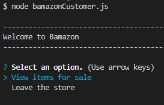
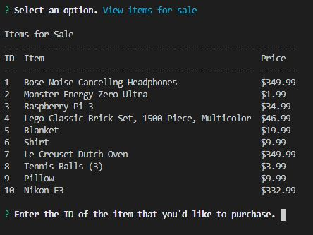
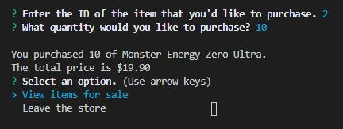
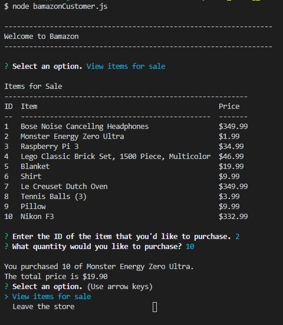
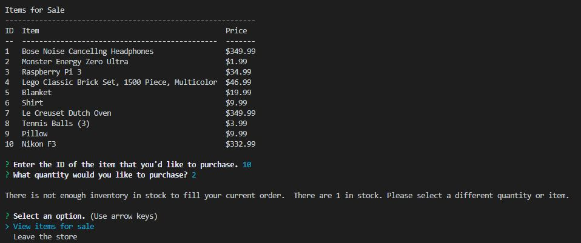

# Bamazon
Bamazon is an Amazon-like CLI application that will take in orders from customers and deplete stock from the store's inventory.  Additional functionality was added to track product sales across the store's departments, and then provide a summary of the highest grossing departments in the store.

<h1>Technology used include:</h1>
- Javascript
 
- Node.js
 
- MySQL
 

<h1>Application Overview and Demo</h1>
The store includes three interconnected node applications--Customer Interface, Manager Interface, and Supervisor Interface.  All three programs interact with the same database on the backend.

<h2>Customer Interface</h2>
The Customer Interface (bamazonCustomer.js) allows you to view the current inventory of store items-IDs, descriptions, and departments.  You can the purhcase one of the instock items by entering the ID and quantity.  If the current quantity is currently in stock, the order is fulfilled, the total purchase price will be displayed, and database will be updated.  However, if the requested quantity exceeds the amount available in inventory, then the order will not go through and you will be prompted to revise your order.  

1) Upon first starting the program, the customer will be prompted to either "View items for sale" or to "Leave the store"

2) When the user selects "View items for sale", a table wll be displayed with the items ID, name, and price

3) The user will be prompted to enter the ID of the item along with the quantity they would like to purchase.  

4) If the requested quantity is available, then the user will recieve a confirmation of their purchase along with their total purchase price.  They will again be prompted to either "View items for sale" or to "Leave the store".

5) If there is not enough inventory to fill the order, the user will be advised of this along with the available quantity.  They will then be prompted to either "View items for sale" or to "Leave the store"

<h2>Manager Interface</h2>
The Manager interface (bamazonManager.js)

<h2>Supervisor Interface</h2>
The Supervisor Interface (bamazonSupervisor.js)

<h1>How to Install</h1>

In order to run the application and try it our yourself, please follow the steps below:

1) Set up MySQL Workbench locally.  In order to run this application, you should have the MySQL database already set up on your machine. Use the bamazondbseed.sql file to create the Bamazon database and products table. 
2) git clone this repository to your local machine 
3) In terminal cd bamazon (open the folder contianing the repository in your terminal)
4) in terminal, run "npm install"
5) in terminal, run "node bamazonCustomer.js", "nodebamazonManager", or node "bamazonSupervisor"

